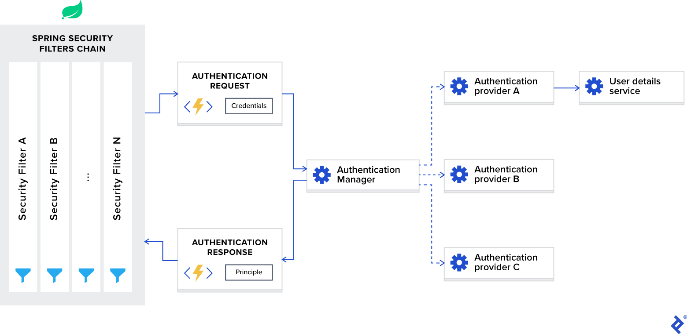

[](https://sonarcloud.io/dashboard?id=J-Dudek_tp1-cybersecu)
# TP cybersécurité M1 S1
La branche [`Clean`](https://github.com/J-Dudek/tp1-cybersecu/tree/Clean "Clean" ) est une branche sans failles volontaire. Etant perfectible, n'hesitez pas à me créer des issues afin d'ameliorer tout cela.

[Troisième Jalon : documentation](#jalon3)
----
## LIBRAIRIE

Cette application comporte des utilisateurs et des livres.

Les utilisateurs possedent une liste de livres, ils peuvent en ajouter et en retirer.
Pour effectuer un ajout il faut que le livre soit référencé dans la base de la librairie.

Le but étant qu'un utilisateur ayant un livre physiquement chez lui peut l'ajouter à sa base de données si il est présent dan le réferentiel de la librairie.

En cas de revente/perte etc.. il peut le supprimer de son catalogue personnel.
Il y a actuellement deux roles dans la librairie `ROLE_ADMIN` et `ROLE_USER`.

Lors de l'authentification  sur `/users/signin` un filtre est effectué et un `token` généré est retourné constitué du `role` et de l'`username` de l'utilisateur.

Pour devenir utilisateur: se rendre sur `/users/signup` .

### Scenario
Un utilisateur peut: 
- consulter la liste de livre de la base.
- affecter à sa collection un livre existant dans la bibliothèque.
- supprimer un livre de sa propre collection.
- consulter la liste de ses livres.
- modifier son mot de passe.
- supprimer son propre compte.

Un administrateur peut:
- effectuer les mêmes actions que l'utilisateur.
- créer,modifier et supprimer des livres dans la bibliothèque.
- autres fonctions à venir.

 🚧 Toutes les fonctionnalités ne sont pas encore implémentées:  🚧.


## Comment tester l'API ?
- `https://github.com/J-Dudek/tp1-cybersecu.git`
- `gh repo clone J-Dudek/tp1-cybersecu`
#### OU
- `docker run -it -p 8282:8282  julienm1/tp1-cybersecurite:clean` Pour la version non trouée
#### Ensuite ?
Après avoir lancé l'application :
- Se rendre sur http://localhost:8282/swagger-ui.html , vous aurez alors accès aux différentes fonctionnalités de l'API.

|Username|Password|Role|
|:-:|:-:|:-:|
|Gertrude|Cyb&rCQrizTh3|ADMIN|
|user|Cyb&rCQrizTh3|USER|
|user2|Cyb&rCQrizTh3|USER|
 

## SURFACE D'ATTAQUE
[![](https://mermaid.ink/img/eyJjb2RlIjoiZ3JhcGggVERcbiAgQVtPU10gLS0-IEIoRG9ja2VyKVxuICBCIC0tPiBDW1RvbWNhdF1cbiAgQy0tPkhcbiAgSFtKYXZhXS0tPkZbV2ViQXBwXVxuICBILS0-SltTUUwtSDJdXG5cbiIsIm1lcm1haWQiOnsidGhlbWUiOiJkZWZhdWx0IiwidGhlbWVWYXJpYWJsZXMiOnsiYmFja2dyb3VuZCI6IndoaXRlIiwicHJpbWFyeUNvbG9yIjoiI0VDRUNGRiIsInNlY29uZGFyeUNvbG9yIjoiI2ZmZmZkZSIsInRlcnRpYXJ5Q29sb3IiOiJoc2woODAsIDEwMCUsIDk2LjI3NDUwOTgwMzklKSIsInByaW1hcnlCb3JkZXJDb2xvciI6ImhzbCgyNDAsIDYwJSwgODYuMjc0NTA5ODAzOSUpIiwic2Vjb25kYXJ5Qm9yZGVyQ29sb3IiOiJoc2woNjAsIDYwJSwgODMuNTI5NDExNzY0NyUpIiwidGVydGlhcnlCb3JkZXJDb2xvciI6ImhzbCg4MCwgNjAlLCA4Ni4yNzQ1MDk4MDM5JSkiLCJwcmltYXJ5VGV4dENvbG9yIjoiIzEzMTMwMCIsInNlY29uZGFyeVRleHRDb2xvciI6IiMwMDAwMjEiLCJ0ZXJ0aWFyeVRleHRDb2xvciI6InJnYig5LjUwMDAwMDAwMDEsIDkuNTAwMDAwMDAwMSwgOS41MDAwMDAwMDAxKSIsImxpbmVDb2xvciI6IiMzMzMzMzMiLCJ0ZXh0Q29sb3IiOiIjMzMzIiwibWFpbkJrZyI6IiNFQ0VDRkYiLCJzZWNvbmRCa2ciOiIjZmZmZmRlIiwiYm9yZGVyMSI6IiM5MzcwREIiLCJib3JkZXIyIjoiI2FhYWEzMyIsImFycm93aGVhZENvbG9yIjoiIzMzMzMzMyIsImZvbnRGYW1pbHkiOiJcInRyZWJ1Y2hldCBtc1wiLCB2ZXJkYW5hLCBhcmlhbCIsImZvbnRTaXplIjoiMTZweCIsImxhYmVsQmFja2dyb3VuZCI6IiNlOGU4ZTgiLCJub2RlQmtnIjoiI0VDRUNGRiIsIm5vZGVCb3JkZXIiOiIjOTM3MERCIiwiY2x1c3RlckJrZyI6IiNmZmZmZGUiLCJjbHVzdGVyQm9yZGVyIjoiI2FhYWEzMyIsImRlZmF1bHRMaW5rQ29sb3IiOiIjMzMzMzMzIiwidGl0bGVDb2xvciI6IiMzMzMiLCJlZGdlTGFiZWxCYWNrZ3JvdW5kIjoiI2U4ZThlOCIsImFjdG9yQm9yZGVyIjoiaHNsKDI1OS42MjYxNjgyMjQzLCA1OS43NzY1MzYzMTI4JSwgODcuOTAxOTYwNzg0MyUpIiwiYWN0b3JCa2ciOiIjRUNFQ0ZGIiwiYWN0b3JUZXh0Q29sb3IiOiJibGFjayIsImFjdG9yTGluZUNvbG9yIjoiZ3JleSIsInNpZ25hbENvbG9yIjoiIzMzMyIsInNpZ25hbFRleHRDb2xvciI6IiMzMzMiLCJsYWJlbEJveEJrZ0NvbG9yIjoiI0VDRUNGRiIsImxhYmVsQm94Qm9yZGVyQ29sb3IiOiJoc2woMjU5LjYyNjE2ODIyNDMsIDU5Ljc3NjUzNjMxMjglLCA4Ny45MDE5NjA3ODQzJSkiLCJsYWJlbFRleHRDb2xvciI6ImJsYWNrIiwibG9vcFRleHRDb2xvciI6ImJsYWNrIiwibm90ZUJvcmRlckNvbG9yIjoiI2FhYWEzMyIsIm5vdGVCa2dDb2xvciI6IiNmZmY1YWQiLCJub3RlVGV4dENvbG9yIjoiYmxhY2siLCJhY3RpdmF0aW9uQm9yZGVyQ29sb3IiOiIjNjY2IiwiYWN0aXZhdGlvbkJrZ0NvbG9yIjoiI2Y0ZjRmNCIsInNlcXVlbmNlTnVtYmVyQ29sb3IiOiJ3aGl0ZSIsInNlY3Rpb25Ca2dDb2xvciI6InJnYmEoMTAyLCAxMDIsIDI1NSwgMC40OSkiLCJhbHRTZWN0aW9uQmtnQ29sb3IiOiJ3aGl0ZSIsInNlY3Rpb25Ca2dDb2xvcjIiOiIjZmZmNDAwIiwidGFza0JvcmRlckNvbG9yIjoiIzUzNGZiYyIsInRhc2tCa2dDb2xvciI6IiM4YTkwZGQiLCJ0YXNrVGV4dExpZ2h0Q29sb3IiOiJ3aGl0ZSIsInRhc2tUZXh0Q29sb3IiOiJ3aGl0ZSIsInRhc2tUZXh0RGFya0NvbG9yIjoiYmxhY2siLCJ0YXNrVGV4dE91dHNpZGVDb2xvciI6ImJsYWNrIiwidGFza1RleHRDbGlja2FibGVDb2xvciI6IiMwMDMxNjMiLCJhY3RpdmVUYXNrQm9yZGVyQ29sb3IiOiIjNTM0ZmJjIiwiYWN0aXZlVGFza0JrZ0NvbG9yIjoiI2JmYzdmZiIsImdyaWRDb2xvciI6ImxpZ2h0Z3JleSIsImRvbmVUYXNrQmtnQ29sb3IiOiJsaWdodGdyZXkiLCJkb25lVGFza0JvcmRlckNvbG9yIjoiZ3JleSIsImNyaXRCb3JkZXJDb2xvciI6IiNmZjg4ODgiLCJjcml0QmtnQ29sb3IiOiJyZWQiLCJ0b2RheUxpbmVDb2xvciI6InJlZCIsImxhYmVsQ29sb3IiOiJibGFjayIsImVycm9yQmtnQ29sb3IiOiIjNTUyMjIyIiwiZXJyb3JUZXh0Q29sb3IiOiIjNTUyMjIyIiwiY2xhc3NUZXh0IjoiIzEzMTMwMCIsImZpbGxUeXBlMCI6IiNFQ0VDRkYiLCJmaWxsVHlwZTEiOiIjZmZmZmRlIiwiZmlsbFR5cGUyIjoiaHNsKDMwNCwgMTAwJSwgOTYuMjc0NTA5ODAzOSUpIiwiZmlsbFR5cGUzIjoiaHNsKDEyNCwgMTAwJSwgOTMuNTI5NDExNzY0NyUpIiwiZmlsbFR5cGU0IjoiaHNsKDE3NiwgMTAwJSwgOTYuMjc0NTA5ODAzOSUpIiwiZmlsbFR5cGU1IjoiaHNsKC00LCAxMDAlLCA5My41Mjk0MTE3NjQ3JSkiLCJmaWxsVHlwZTYiOiJoc2woOCwgMTAwJSwgOTYuMjc0NTA5ODAzOSUpIiwiZmlsbFR5cGU3IjoiaHNsKDE4OCwgMTAwJSwgOTMuNTI5NDExNzY0NyUpIn19LCJ1cGRhdGVFZGl0b3IiOmZhbHNlfQ)](https://mermaid-js.github.io/mermaid-live-editor/#/edit/eyJjb2RlIjoiZ3JhcGggVERcbiAgQVtPU10gLS0-IEIoRG9ja2VyKVxuICBCIC0tPiBDW1RvbWNhdF1cbiAgQy0tPkhcbiAgSFtKYXZhXS0tPkZbV2ViQXBwXVxuICBILS0-SltTUUwtSDJdXG5cbiIsIm1lcm1haWQiOnsidGhlbWUiOiJkZWZhdWx0IiwidGhlbWVWYXJpYWJsZXMiOnsiYmFja2dyb3VuZCI6IndoaXRlIiwicHJpbWFyeUNvbG9yIjoiI0VDRUNGRiIsInNlY29uZGFyeUNvbG9yIjoiI2ZmZmZkZSIsInRlcnRpYXJ5Q29sb3IiOiJoc2woODAsIDEwMCUsIDk2LjI3NDUwOTgwMzklKSIsInByaW1hcnlCb3JkZXJDb2xvciI6ImhzbCgyNDAsIDYwJSwgODYuMjc0NTA5ODAzOSUpIiwic2Vjb25kYXJ5Qm9yZGVyQ29sb3IiOiJoc2woNjAsIDYwJSwgODMuNTI5NDExNzY0NyUpIiwidGVydGlhcnlCb3JkZXJDb2xvciI6ImhzbCg4MCwgNjAlLCA4Ni4yNzQ1MDk4MDM5JSkiLCJwcmltYXJ5VGV4dENvbG9yIjoiIzEzMTMwMCIsInNlY29uZGFyeVRleHRDb2xvciI6IiMwMDAwMjEiLCJ0ZXJ0aWFyeVRleHRDb2xvciI6InJnYig5LjUwMDAwMDAwMDEsIDkuNTAwMDAwMDAwMSwgOS41MDAwMDAwMDAxKSIsImxpbmVDb2xvciI6IiMzMzMzMzMiLCJ0ZXh0Q29sb3IiOiIjMzMzIiwibWFpbkJrZyI6IiNFQ0VDRkYiLCJzZWNvbmRCa2ciOiIjZmZmZmRlIiwiYm9yZGVyMSI6IiM5MzcwREIiLCJib3JkZXIyIjoiI2FhYWEzMyIsImFycm93aGVhZENvbG9yIjoiIzMzMzMzMyIsImZvbnRGYW1pbHkiOiJcInRyZWJ1Y2hldCBtc1wiLCB2ZXJkYW5hLCBhcmlhbCIsImZvbnRTaXplIjoiMTZweCIsImxhYmVsQmFja2dyb3VuZCI6IiNlOGU4ZTgiLCJub2RlQmtnIjoiI0VDRUNGRiIsIm5vZGVCb3JkZXIiOiIjOTM3MERCIiwiY2x1c3RlckJrZyI6IiNmZmZmZGUiLCJjbHVzdGVyQm9yZGVyIjoiI2FhYWEzMyIsImRlZmF1bHRMaW5rQ29sb3IiOiIjMzMzMzMzIiwidGl0bGVDb2xvciI6IiMzMzMiLCJlZGdlTGFiZWxCYWNrZ3JvdW5kIjoiI2U4ZThlOCIsImFjdG9yQm9yZGVyIjoiaHNsKDI1OS42MjYxNjgyMjQzLCA1OS43NzY1MzYzMTI4JSwgODcuOTAxOTYwNzg0MyUpIiwiYWN0b3JCa2ciOiIjRUNFQ0ZGIiwiYWN0b3JUZXh0Q29sb3IiOiJibGFjayIsImFjdG9yTGluZUNvbG9yIjoiZ3JleSIsInNpZ25hbENvbG9yIjoiIzMzMyIsInNpZ25hbFRleHRDb2xvciI6IiMzMzMiLCJsYWJlbEJveEJrZ0NvbG9yIjoiI0VDRUNGRiIsImxhYmVsQm94Qm9yZGVyQ29sb3IiOiJoc2woMjU5LjYyNjE2ODIyNDMsIDU5Ljc3NjUzNjMxMjglLCA4Ny45MDE5NjA3ODQzJSkiLCJsYWJlbFRleHRDb2xvciI6ImJsYWNrIiwibG9vcFRleHRDb2xvciI6ImJsYWNrIiwibm90ZUJvcmRlckNvbG9yIjoiI2FhYWEzMyIsIm5vdGVCa2dDb2xvciI6IiNmZmY1YWQiLCJub3RlVGV4dENvbG9yIjoiYmxhY2siLCJhY3RpdmF0aW9uQm9yZGVyQ29sb3IiOiIjNjY2IiwiYWN0aXZhdGlvbkJrZ0NvbG9yIjoiI2Y0ZjRmNCIsInNlcXVlbmNlTnVtYmVyQ29sb3IiOiJ3aGl0ZSIsInNlY3Rpb25Ca2dDb2xvciI6InJnYmEoMTAyLCAxMDIsIDI1NSwgMC40OSkiLCJhbHRTZWN0aW9uQmtnQ29sb3IiOiJ3aGl0ZSIsInNlY3Rpb25Ca2dDb2xvcjIiOiIjZmZmNDAwIiwidGFza0JvcmRlckNvbG9yIjoiIzUzNGZiYyIsInRhc2tCa2dDb2xvciI6IiM4YTkwZGQiLCJ0YXNrVGV4dExpZ2h0Q29sb3IiOiJ3aGl0ZSIsInRhc2tUZXh0Q29sb3IiOiJ3aGl0ZSIsInRhc2tUZXh0RGFya0NvbG9yIjoiYmxhY2siLCJ0YXNrVGV4dE91dHNpZGVDb2xvciI6ImJsYWNrIiwidGFza1RleHRDbGlja2FibGVDb2xvciI6IiMwMDMxNjMiLCJhY3RpdmVUYXNrQm9yZGVyQ29sb3IiOiIjNTM0ZmJjIiwiYWN0aXZlVGFza0JrZ0NvbG9yIjoiI2JmYzdmZiIsImdyaWRDb2xvciI6ImxpZ2h0Z3JleSIsImRvbmVUYXNrQmtnQ29sb3IiOiJsaWdodGdyZXkiLCJkb25lVGFza0JvcmRlckNvbG9yIjoiZ3JleSIsImNyaXRCb3JkZXJDb2xvciI6IiNmZjg4ODgiLCJjcml0QmtnQ29sb3IiOiJyZWQiLCJ0b2RheUxpbmVDb2xvciI6InJlZCIsImxhYmVsQ29sb3IiOiJibGFjayIsImVycm9yQmtnQ29sb3IiOiIjNTUyMjIyIiwiZXJyb3JUZXh0Q29sb3IiOiIjNTUyMjIyIiwiY2xhc3NUZXh0IjoiIzEzMTMwMCIsImZpbGxUeXBlMCI6IiNFQ0VDRkYiLCJmaWxsVHlwZTEiOiIjZmZmZmRlIiwiZmlsbFR5cGUyIjoiaHNsKDMwNCwgMTAwJSwgOTYuMjc0NTA5ODAzOSUpIiwiZmlsbFR5cGUzIjoiaHNsKDEyNCwgMTAwJSwgOTMuNTI5NDExNzY0NyUpIiwiZmlsbFR5cGU0IjoiaHNsKDE3NiwgMTAwJSwgOTYuMjc0NTA5ODAzOSUpIiwiZmlsbFR5cGU1IjoiaHNsKC00LCAxMDAlLCA5My41Mjk0MTE3NjQ3JSkiLCJmaWxsVHlwZTYiOiJoc2woOCwgMTAwJSwgOTYuMjc0NTA5ODAzOSUpIiwiZmlsbFR5cGU3IjoiaHNsKDE4OCwgMTAwJSwgOTMuNTI5NDExNzY0NyUpIn19LCJ1cGRhdGVFZGl0b3IiOmZhbHNlfQ)

## Objectifs de sécurité
|Confidentialité 4/5|Intégrité 4/5|Disponibilité 4/5|Traçabilité 4/5|
|:-:|:-:|:-:|:-:|
|Utilisation d'un token pour protéger les routes|Utilisation de Data Transfert Object|Utilisation de différents rôle|Faible niveau de log avec uniquement les erreurs remontées|
|   |Utilisation d'une couche service avant accès à la base|Insertion dans le token d'un hash permettant d'identifier l'utilisateur|   |


## Troisième Jalon : Documentation<a id="jalon3"></a>
>- Pour chaque fonctionnalité de sécurité que vous ajoutez (ORM par exemple) :
>    - Vous décrivez de quoi la fonctionnalité protège votre code
>    - Vous décrivez comment la fonctionnalité protège votre code
>    - Vous définissez le(s) mécanisme(s) ET le(s) principe(s) de sécurité que votre code implique ;
>    - Décrivez les tests que vous feriez pour vérifier que cet endpoint (cette page web) n'est pas vulnérable (Les tests vont vous permettre de renforcer >l'implémentation des principes de dev sécurisés)
>   - (En bonus) Quel impact aurait eu cette vulnérabilité sur votre métier (Injection SQL => Fuite de données => Incident diplomatique => vous fermez votre >business)
### - Gestion des exceptions

La garantie de __gestion d'erreur fiable__ par l'implémentation "custom" des remontées d'exception afin de ne pas remonter d'information structurelle mais uniquement ce qui est nécessaire. Par exemple en cas de soucis de login/mot de passe: ```"Invalid username/password supplied"```
```
├── exception
│   ├── CustomException.java
│   └── GlobalExceptionHandlerController.java
 ````

### - BDD (spring-boot-starter-data-jpa)
Spring Boot JPA est une spécification Java pour la gestion des données relationnelles dans les applications Java. Il nous permet d'accéder et de conserver les données entre l'objet / classe Java et la base de données relationnelle. JPA suit le mappage objet-relation (ORM). C'est un ensemble d'interfaces. Il fournit également une API EntityManager d' exécution pour le traitement des requêtes et des transactions sur les objets par rapport à la base de données. Il utilise un langage de requête orienté objet indépendant de la plate-forme JPQL (Java Persistent Query Language).
JPA convient aux applications complexes non orientées performances. Le principal avantage de JPA par rapport à JDBC est que, dans JPA, les données sont représentées par des objets et des classes tandis que dans JDBC les données sont représentées par des tables et des enregistrements. Il utilise POJO pour représenter des données persistantes qui simplifient la programmation de la base de données.
Une explication du fonctionnement globale et disponible [ici](https://www.javatpoint.com/spring-boot-jpa).


__Principes de Sécurité :__
- La disponibilité : maintenir le bon fonctionnement du système d'information.
- La non répudiation : garantir qu'une transaction ne peut être niée.

Une non disponibilité des services pour un moment donné engendrerai la perte de confiance des utilisateurs et leur départ pour une autre application.


### - Gestion des mots de passe (spring-boot-starter-security)
Volontairement 3 utilisateurs sont crées au démarrage de l'application, leur mot de passe apparait donc dans le code et le readme.
Afin de démontrer le niveau de sécurité des mots de passe, le choix d'un mot de passe identique pour ces trois comptes a été fait.
En vous rendant sur http://localhost:8282/h2-console (JDBC_URL:jdbc:h2:mem:cybersecu , username:admin , password:admin) et en executant ```select * from user```vous pourrez constater le hashage et salage du mot de passe.

- Le hashage/salage des mots de passes permet qu'en cas d'intrusion et/ou fuite de données il n'y ai pas d'usurpation des comptes utilisateurs.
Se protéger contre ces attaques permet une __intégrité__ de la plateforme. Une faille de sécurité au niveau des mots de passe aurait comme conséquence une perte de crédibilité et donc une perte des utilisateurs.

### - JWT TOKEN , ```http.crsf.disable()```(spring-boot-starter-security)
- Architecture de Spring security

Lorsque vous ajoutez le framework Spring Security à votre application, il enregistre automatiquement une chaîne de filtres qui intercepte toutes les demandes entrantes. Cette chaîne se compose de différents filtres, et chacun d'eux gère un cas d'utilisation particulier.

Après avoir configuré le gestionnaire d'authentification, nous devons maintenant configurer la sécurité Web. Nous implémentons une API REST et avons besoin d'une authentification sans état avec un jeton JWT; par conséquent, nous devons définir les options suivantes:
- Enable CORS and disable CSRF
- Set session management to stateless.
- Set unauthorized requests exception handler.
- Set permissions on endpoints.
- Add JWT token filter.

C'est donc pour cette raison que vous trouverez dans le package ```security```  :
- Interface principale qui charge des données spécifiques à l'utilisateur :
 ```java
 public class MyUserDetails implements UserDetailsService 
 ```
 - Une classe qui va génerer le JWT contenant le rôle de l'utilisateur chargé par la classe précédente
 ```java
 public class JwtTokenProvider
 ```
 Cette classe gère également la validité temporel et structurel du token et la vérification de l'identité de l'user au cours du parcours.
 
 - Deux classes qui vont effectuées les filtres HTTP des requêtes :
  ```java
 public class JwtTokenFilterConfigurer extends SecurityConfigurerAdapter<DefaultSecurityFilterChain, HttpSecurity> 
 ````
 Une classe de base pour SecurityConfigurer qui permet aux sous-classes d'implémenter uniquement les méthodes qui les intéressent. Elle fournit également un mécanisme pour utiliser SecurityConfigurer et, une fois terminé, accéder au SecurityBuilder en cours de configuration.
 ```java
 public class JwtTokenFilter extends OncePerRequestFilter
 ```
 Classe de base de filtre qui vise à garantir une exécution unique par envoi de requête, sur n'importe quel conteneur de servlet. Il fournit une méthode doFilterInternal avec les arguments HttpServletRequest et HttpServletResponse.
 ```java
 public class WebSecurityConfig extends WebSecurityConfigurerAdapter
 ```
Fournit une classe de base pratique pour créer une instance WebSecurityConfigurer. L'implémentation permet la personnalisation en remplaçant les méthodes.
C'est ici qu'est désactivé crsf et que certains endpoints sont autorisés tel que :
```java
http.authorizeRequests()//
                .antMatchers("/users/signin").permitAll()//
                .antMatchers("/users/signup").permitAll()//
                .antMatchers("/h2-console/**/**").permitAll()
                // On desactive les autres
                .anyRequest().authenticated();
```
Le JWT sécurise le protocole sans état en envoyant les informations pour l’authentification directement lors de la requête, le JSON Web Token envoie les informations lors du Cross Origin Resource Sharing. Cela présente un énorme avantage par rapport aux cookies, qui ne sont généralement pas envoyés dans cette procédure.Il a aussi l'avantage d'être multi-framework et permet donc plusieurs type d'appels à notre API.__La garantie de segmentation__ et le __principe de moindre privilège__ sont ainsi appliqué au mieux par cette structure.

__Principes de Sécurité :__ 
- L'authentification : assurer que seules les personnes autorisées aient accès aux ressources.
- La confidentialité : rendre l'information inintelligible à d'autres personnes que les seuls acteurs d’une transaction. 
- L'intégrité : garantir que les données sont bien celles que l'on croit être.

Ces mécanismes de protections permettent de se protéger contre les attaques de type IDOR et les XSS.

Afin de tester et vérifier la présence d'une faille d'authentification il serait possible d'executer : `curl -X DELETE "http://localhost:8282/users/{username}" -H "accept: */*"`avec l'username cible pour supprimer un utilisateur. Cela testerait l'autorisation (endpoint autorisé uniquement à un administrateur) et l'authentification.

L'utilisation de [Sonarcloud](https://sonarcloud.io/dashboard?id=J-Dudek_tp1-cybersecu) m'a permis également d'optimiser certaine partie de mon code en me rappelant des règles que l'on a tendance à oublier. Il aide également à une __garantie de pérénité__ afin de minimiser au maximum __la surface d'ataque__.

## SUJET
> ---
>
>Projet Individuel
>Deadline : 10/02/21
>
>---
>
>Ecrivez un projet sur lequel vous avez carte blanche (carte blanche sur le langage et les fonctionnalités du projet).
>
>Pour que le projet soit reçevable, ses pré-requis sont :
>
>- Le projet doit pouvoir être lancé avec une commande docker (et donc doit avoir un Dockerfile).
>  - Si la commande Docker ne fonctionne pas, la note sera sévère parce que je vais pas débugger le code de 30 personnes.
>  - La commande doit apparaitre dans /README.md
>
>- Le projet doit faire apparaitre un dossier /tests qui contiendra les tests unitaires qui permettraient de trouver les vulnérabilités dans votre code (vous avez carte blanche sur votre framework de test)
>  - Par exemple : Un test d'injection SQL sur un paramètre GET
>
>- Le projet doit faire un apparaitre un dossier /exploit qui contiendra les scripts qui permettront d'exploiter les vulnérabilités (vous avez carte blanche sur le langage du script, il faut que le script soit concis)
>
>- Le projet doit être un dépôt github publique, pour que je puisse y jeter des coups d'oeil et pour les corrections
>
>- Le code doit être lisible et donc correctement commenté pour quelqu'un qui n'est pas dev (genre moi) mais qui sait lire de code (pas de "i++; // on incrémente i"). Si le code n'est pas propre et me fait perdre du temps quand je le lis, il y aura des malus.
>
>- Le fichier README.md doit faire apparaitre les objectifs de sécurité de l'application :
>   - Ses objectif en Confidentialité, Intégrité et Disponibilité (note /5)
>
>- Le fichier README.md doit faire apparaitre un graph mermaidjs avec la surface d'attaque
>
>- Un fichier Excel avec la même analyse de sécurité que le premier TP doit aussi apparaitre.
>
>---
>
>Ce TP est le projet du cours et donnera votre note de ce cours !
>---
